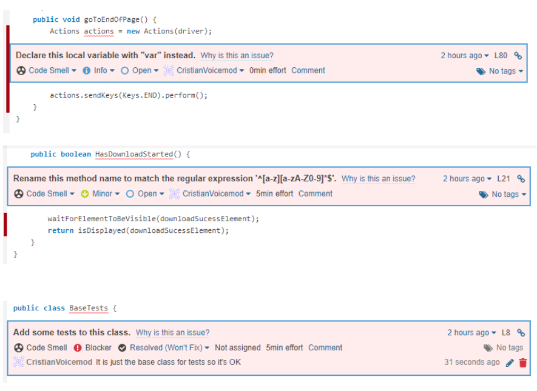

# challenge-voicemod
The aim of this project is answering the 'QA TEST - VOICEMOD'. It has several parts.
* In the first part, Functional Testing, the explanation of the tests chosen is found.
* In the second part, Automation Testing, everything related to the framework and the test automation is explained.
* The section Sonar shows the static analysis run in SonarCloud.  
* The last part documents some insights got during the automation process and some exploratory testing.

## Functional Testing
The first thing a user sees when (s)he enters [the Voicemod homepage](https://www.voicemod.net/) from the computers' 
browser is a big button that says 'GET VOICEMOD FREE'. 
When it is clicked, what I called [the Account page](https://account.voicemod.net/) is loaded.
From there, the user can create an account in different ways. After that, (s)he will be redirected to what I called 
[the Download page](https://account.voicemod.net/?t=1620998025#/account-activated-success/) and the Voicemod download 
will start.

On the other hand, Voicemod Clips download can be done from what I called 
[the Apps Page](https://www.voicemod.net/voicemod-clips/), that can be accessed from the Homepage and then clicking in 
Our Apps in the top bar.

I am assuming that one of the top priorities of the company currently is acquiring more clients so from my point of 
view, assuring that the happy paths of the downloads of both applications work are the most important test cases.
In order to do so, the functional test cases that I have defined and then automated are the following:
1) The main button 'GET VOICEMOD FREE' in the Homepage links to the Account page.
2) The button 'GET VOICEMOD FREE' that appears in the Homepage after scrolling, links to the Account page.
3) The Account page works properly, redirecting to the correct login page of the third parties. For saving time, I have 
just considered Discord and Twitch, but the others should be checked as well.
4) The download of Voicemod starts from the Download page.
5) From the Apps page, the links to the apps work for both Google Play and App Store.

## Automation Testing
### How to launch the tests
1) Download and install [IntelliJ IDEA Community](https://www.jetbrains.com/idea/download).
2) Clone this repository and open it as a project in IntelliJ.
3) Open File --> Project Structure. In Project SDK, click on Add SDK --> Download JDK and select Oracle OpenJDK 16 or 
   above. Accept changes. Wait until the process is completed.
4) Build the project with Build --> Build Project.
5) Windows:
    * Download [geckodriver](https://github.com/mozilla/geckodriver/releases) and unzip it in a folder `resources` inside 
the project. 
      
    Mac:
    * `npm install geckodriver`
    * In src/test/java/base/BaseTests.java comment the line `System.setProperty("webdriver.gecko.driver", "resources/geckodriver.exe");`
6) Install the latest version of Firefox Browser in your machine.
7) In the project tree, right click on src/test/java and select Run 'All Tests'.   

### Structure
This a Maven project. It uses the Page Object Model pattern. Tests are based on TestNG.
* The package src/main/java/pages contains the pages needed. All of them inherits from the BasePage that contains handy 
common methods.
* Several packages can be found in test/java. Each one represents a different context. The test classes of each context 
can be found inside. BaseTests contains the methods for handling the driver properly during the suite setup and teardown.
  
## Sonar
The results of the SonarCloud analysis can be found in the following image. The corrections I made afterwards:
* Replace `Actions actions = new Actions(driver);` by `var Actions = new Actions(driver);`.
* Rename `HasDownloadStarted` by `hasDownloadStarted`.
* I didn't change anything in BaseTests but mark it in Sonar as won't fix.

## Insights
You can find in here some comments that may be useful.
### Automated tests
Sometimes, the test `testDownloadStarts` fails. Regardless the download page is accessed directly or organically 
(tested with email option), the download doesn't start automatically. A blink can be seen in the page, but it is not updated.
I just saw this failing on May 17th morning.

### Exploratory testing
After doing some exploratory testing I have some concerns of behaviors that may impact the user experience:
* When voicemod.net loads the page is in English but the cookies message is in Spanish.
* Clicking on the button 'GET VOICEMOD FREE' loads the next page in the local language. I wonder why this same behavior
  is not implemented for the homepage.
* For all languages but Japanese, the button 'GET VOICEMOD FREE' that appears after scrolling is in English instead of translated.
* In Spanish, Nuestra App in the top bar shows the content in English when clicking on it. However, it seems the expected 
behavior as https://www.voicemod.net/es/voicemod-clips/ doesn't exist. I didn't test this for the rest of languages.
* In Spanish, FAQ in the top bar redirects to the English version instead of to https://support.voicemod.net/hc/es.

Overall it seems that the i18n should be revisited.

If you have any questions, do not hesitate to ping me.

Best,

Cristian
